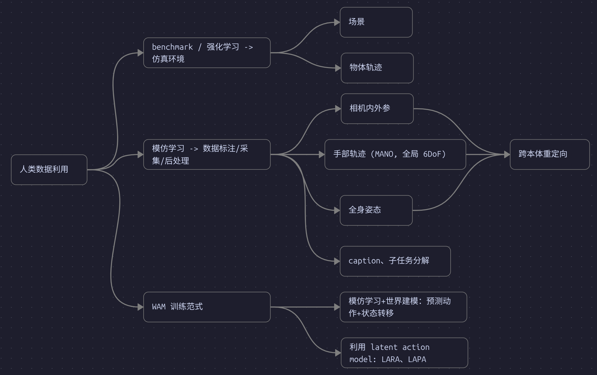
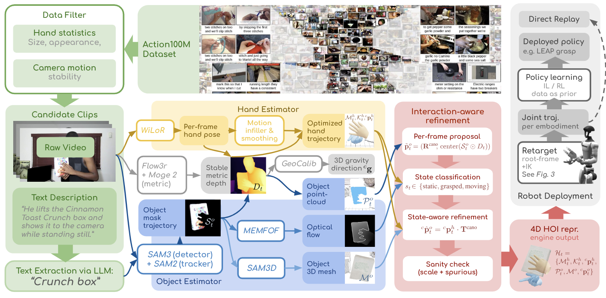
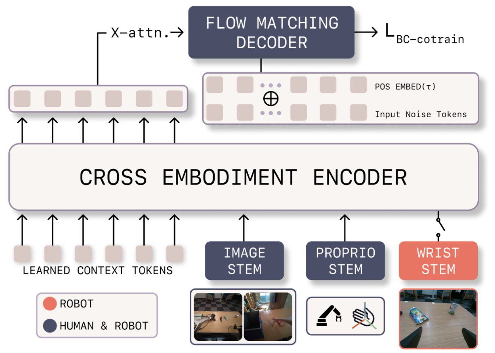
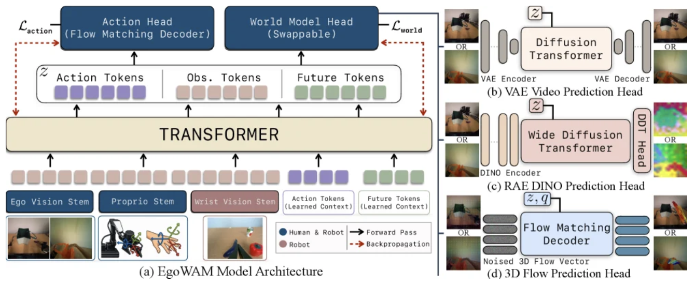
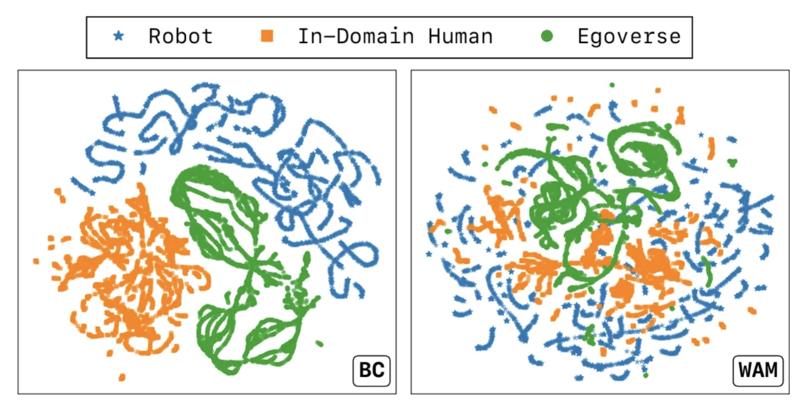
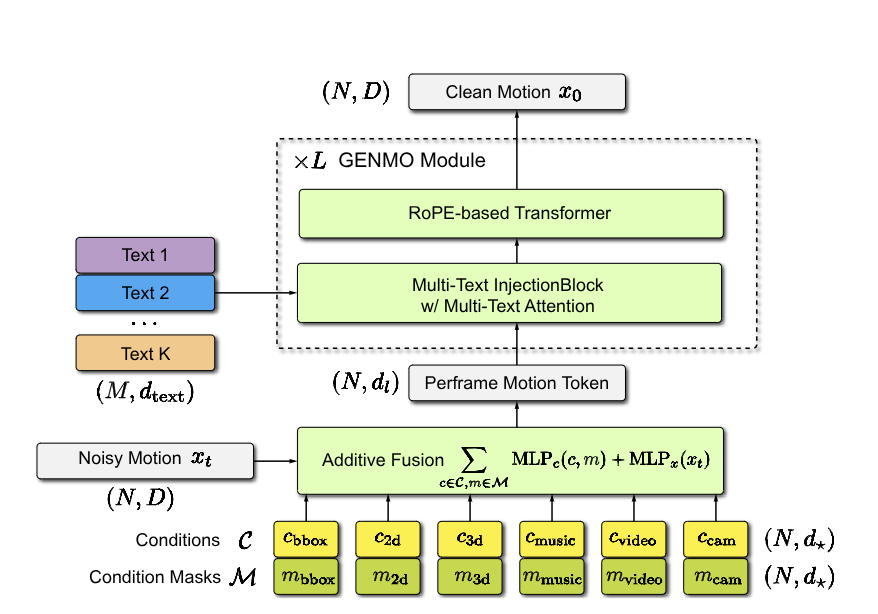

## 利用场景和现状



数据和训练 recipe:

| 模型               | 数据组成                                 | 总时长  |
| ---------------- | ---------------------------------------- | ---- |
| DreamZero        | 真机 100%                                  | 0.5k |
| LingBot-VA 2     | 未详细说明，含仿真真机 Ego 数据                 |  /  |
| Hunyuan-Embodied-0.5-VLA | UMI 100% (+offline RL 遥操干预)              | >10k |
| InternVLA-A1.5   | 真机 54% 仿真 46%                            | ~10k |
| Qwen-RobotManip  | 真机 20% 仿真 10% Ego 5% *Human2Robot* *65%* | 38k  |
| LingBot-VLA 2.0  | 真机 ~83% Ego ~17%                         | ~60k |
| Xiaomi-Robotics-1 | UMI 100%  | 100k |

总体来说，人类数据还未在目前预训练中占很大成分。


## 数据管线

### 一般流程

| 阶段         | 输入                 | 输出                      | 核心操作                             |
| ---------- | ------------------ | ----------------------- | -------------------------------- |
| 粗筛         | 视频、多相机、IMU、手套、已有标注 | 候选操作视频                  | 去除无交互、第三人称和低质量片段                 |
| 子任务分割      | 候选视频               | 1--20 s 操作片段            | 按对象、动作和停顿切成完整子任务                 |
| 多流同步       | 图像与传感器流            | 同步序列                    | 对齐帧、状态、动作和触觉时间戳，确保表示没有矛盾         |
| 定位与分割      | 同步序列               | mask、track、caption、接触状态 | 找出手、人体、交互物体和动作语义                 |
| 3D 重建、动作标注 | 2D 观测与设备标注         | 人类动作表示                  | 恢复相机、深度、手/物体/人体运动或 latent action |
| 统一尺度和坐标    | 各模型输出              | 规范化人类轨迹                 | 统一尺度、坐标系、旋转和帧率                   |
| 机器人重定向     | 规范化轨迹              | 机器人训练动作                 | 重定向、IK 或 latent grounding        |
| （视觉对齐）     | 人类视频与机器人动作         | 机器人外观视频                 | 移除人手，渲染并合成机器人                    |
| 清洗         | 图像、语义、轨迹           | 合格 episode              | 检查连续性、可执行性和跨模态一致性                |

### 逐步做法

#### 粗筛

- **专用设备数据** 可能已经包含相机内外参、VIO/SLAM、深度、手部位姿等。Apple Vision Pro / Project Aria / 其他专用设备（*EgoDex; EgoVerse; EgoLive*）
- **普通 RGB 视频**
- **自动粗筛** 用 VLM 判断视角和交互类型；用手部出现率、手部运动量和相机运动量过滤静止或无效片段（*LingBot-VLA 2.0; EgoInfinity*）

#### 切成原子操作

- **语义切分** 在对象变化、动作类型变化或持续停顿处切分；同一次抓取、搬运和释放可保留为一个 subtask（*LingBot-VLA 2.0*）
- **运动切分** 先由 VLM 粗分，再用手掌速度的局部极小值修正边界（*Scalable VLA Pretraining with Real-Life Human Activity Videos*）
- **跟踪切分** 根据手物检测和轨迹的出现、接触与消失确定边界（*EgoLive*）

#### 定位手、物体和语义

- **手与人体** 检测左右手，跨帧保持身份；全身任务还需检测身体和足部接触。
- **交互物体** 由语言或开放词表检测生成 mask，再跨帧跟踪。用手物距离、运动相关性和接触状态排除“可见但未操作”的物体（*EgoInfinity; EgoLive*）
- **语言标签** 结构化输出 active hand、verb、object、attribute、subtask 和整体任务；不要只保留自由文本
- **辅助标签** 保存 contact/grasp、static/moving、有效帧 mask；触觉数据可增加压力图（*LingBot-VLA 2.0; TouchAnything*）

#### 恢复轨迹

有多种处理方法

- **设备直接给位姿**
	读取 VIO/SLAM 和手部标签，统一为 21 点、MANO 或 6-DoF wrist/palm（*EgoDex; EgoVerse; Qwen-RobotManip*）
- **RGB 恢复手部动作**
	用 WiLoR/HaMeR 估计逐帧 MANO；用 HaWoR、SLAM 或 SfM 移除头部运动，得到全局手轨迹
	后处理：左右手跟踪、缺帧补全、共享手形、骨长/关节约束、时序平滑；相邻片段可用重叠帧刚性对齐（*EgoInfinity; Being-H0.5; Scalable VLA Pretraining with Real-Life Human Activity Videos*）
- **恢复物体位姿**
	物体 3D：估计深度并将物体 mask 反投影为点云
	有 mesh 时做 6-DoF pose tracking，无 mesh 时用点云注册、PnP、光流或点轨迹（*EgoInfinity; EgoLive; Developing VLA from Egocentric Videos*）
	EgoInfinity 接触约束：标注 3 种状态，static 锁定物体；grasped 保持手物刚性变换；moving 采用视觉跟踪结果（*EgoInfinity; EgoGrasp*）
- **恢复全身动作**
	估计 SMPL/SMPL-X、全局 root base、重力和手脚接触，严重遮挡时用 body/HOI diffusion 补全（*GENMO; EgoGrasp*）

#### 统一尺度与坐标

- **内参** 专用设备使用离线标定；互联网视频用 MoGe-2、COLMAP 或 SfM 估计焦距
- **外参** VIO、ORB-SLAM3、egocentric SLAM、HaWoR 或 SfM 输出逐帧 camera-to-world
- **尺度** 深度、相机、手和物体等尺度对齐
- **重力** 用 IMU 或 GeoCalib 确定竖直方向，避免把相机倾斜解释为物体运动
- **坐标流** 先保存世界系轨迹；训练时转换到当前相机系：$p_\tau^{C_t}=T_{C_t\leftarrow W}p_\tau^W$；重定向时再转换到 robot base/root
（*EgoLive; EgoInfinity; LingBot-VLA 2.0*）

#### 机器人重定向

- **平行夹爪** 从指尖位置构造末端位置、朝向和夹爪宽度，再平滑位置、宽度和旋转（*Qwen-RobotManip*）
- **灵巧手** 将 MANO/21 点拟合到机器人指尖或关节，腕部用 IK 控制机械臂，手指单独重定向（*EgoVLA; METIS; EgoInfinity*）
- **Humanoid** 将 SMPL 动作重定向到机器人，删除 IK 不可达、碰撞或动力学不可行的动作，也可先编码为可行 motion token（*SONIC*）
- **robot base** 在轨迹周围生成多个 base/root 候选，按 IK 成功率、残差、可操作度、关节限位和轨迹光滑度选解（*Qwen-RobotManip; EgoInfinity*）
- **速度对齐** 统一控制频率，并对过快的人类动作降采样。Qwen-RobotManip 对 EgoDex、EgoVerse、ViTRA 分别使用原帧率的 60%、45%、25%（*Qwen-RobotManip*）

#### 视觉对齐（*Qwen-RobotManip*）

Qwen-RobotManip 在  中探索了在视频中替换人手：
```
分割并移除人手/手臂
-> 补全背景
-> 对机器人运行 IK
-> 渲染机器人 RGB/depth
-> 按场景深度合成遮挡
```
将 1,933 h 人类源数据转换为 15 种机器人形态，得到约 24,808 h 合成演示。

#### 清洗

- **视频质量** 黑帧、模糊、丢帧、多视角错位、长静止段
- **覆盖率** 手/物体有效帧比例、遮挡率、跟踪丢失率
- **观测质量** SLAM 跳变、尺度异常、背景共动、位置/旋转不连续、异常速度/加速度/jerk
- **动作质量** IK 失败、关节越界、自碰撞、速度超限；用 URDF + FK 核对状态和动作表示等效
- **跨模态质量** 图像中的手、物体、动作顺序与 caption 一致；机器人投影与真实 robot mask 对齐
- **数据划分** 按原视频、场景、操作者和物体去重后再划分训练/测试（*LingBot-VLA 2.0; Qwen-RobotManip*）

## 开源数据集

### 原始人类数据

| 数据集                        | 数据形态与规模                          | 主要场景          | 动作可用性                    | 已验证用途                             |
| -------------------------- | -------------------------------- | ------------- | ------------------------ | --------------------------------- |
| **Ego4D**                  | 第一视角视频，约 3.7k h                  | 日常活动          | 仅 VL 数据                  | ViTRA、UniVLA、Being-H0.5、EgoScaler |
| **EPIC-KITCHENS-100**      | 第一视角视频，约 100 h                   | 厨房操作          | 仅 VL 数据                  | ViTRA、Qwen-RobotManip、Being-H0.5  |
| **Ego-Exo4D**              | 同步第一/第三视角，约 1,286 h              | 技能活动与长程任务     | 相机、人体/手 3D               | ViTRA、EgoScaler                   |
| **Something-Something V2** | 短视频，约 220k 段                     | 通用物体交互        | 仅 VL 数据                  | LAPA、ViTRA                        |
| **Egocentric-10K**         | 第一视角视频，约 10k h                   | 工业与工作活动       | 仅 VL 数据                  | Being-H0.5 经动作恢复后使用               |
| **HD-EPIC**                | 高分辨率第一视角，约 41 h                  | 细粒度厨房操作       | 相机、手物与动作标注               | EgoScaler                         |
| **Nymeria**                | 穿戴式多模态数据，约 300 h                 | 多地点人体活动       | 相机与全身运动                  | EgoScaler                         |
| **EgoDex**                 | Vision Pro 第一视角，829 h / 338k 条示范 | 大规模双手桌面操作     | 双手关节、头/上身、相机、语言          | Qwen-RobotManip                   |
| **EgoVerse**               | 第一视角采集，1,362 h                   | 日常与产业操作，场景覆盖广 | 双手关键点、头部位姿、任务 metadata   | EgoWAM、Qwen-RobotManip            |
| **HOI4D**                  | 第一视角手物视频，4,000 段                 | 单手日常物体操作      | 手/物体 pose、分割、任务语言        | EgoVLA                            |
| **HOT3D**                  | 多视角第一视角，约 13.9 h                 | 少量刚体的精确手物交互   | mocap 手/物体 pose；缺少语言     | EgoVLA                            |
| **HoloAssist**             | 多传感器第一视角，约 166 h                 | 装配、维修等长程任务    | 手/头 pose 和动作文本；手 pose 较噪 | EgoVLA、METIS                      |
| **TACO**                   | 第一/第三视角，2,317 段运动序列              | 双手工具使用        | 手物 mesh、工具运动、动作描述        | EgoVLA                            |

### processed data

| 派生数据/配方                                | 原始来源                               | 统一后的训练信号                           | 产出规模                 | 训练用途                                   |
| -------------------------------------- | ---------------------------------- | ---------------------------------- | -------------------- | -------------------------------------- |
| **ViTRA-1M**                           | Ego4D、EPIC-KITCHENS、Ego-Exo4D、SSV2 | 相机、MANO/手掌轨迹、原子片段、caption          | 1M episodes          | ViTRA 预训练；Qwen 使用其中约 247 h             |
| **EgoVLA Human Mixture**               | HOI4D、HOT3D、HoloAssist、TACO        | 统一 wrist、hand、camera pose 和语言      | ~500k samples        | 人类动作预训练，再经 IK/retargeting 迁移到 humanoid |
| **UniHand-2.0 Human Portion**          | Ego4D、EPIC、Egocentric-10K、自采等      | 恢复 MANO/相机；生成多粒度语言                 | 16k h / 134M samples | Being-H0.5 人体运动与机器人动作联合预训练             |
| **Qwen Human-to-Robot Synthetic Data** | EgoDex、ViTRA、EgoVerse              | **视觉对齐到机器人** 夹爪映射、base/IK 优化、机器人渲染 | ~24,808 h            | Qwen-RobotManip 主训练数据                  |
| **EgoScaler VLA Set**                  | Ego4D、Ego-Exo4D、HD-EPIC、Nymeria    | 交互物体 6-DoF 与语言                     | 45,157 episodes      | 预训练 $\pi_0$；与机器人数据联合训练                 |

---

## 相关论文

### EgoInfinity(2606.17385)

*自动化 RGB 视频标注*

目前为数不多的真正开源的数据标注管线。调用一系列视觉基础模型，将 RGB 视频标注模块化为 3 维重建和分割任务。


数据集标注包括手部 Mesh、MANO 关键点、手部整体 6DoF 位姿和物体 Mesh：
1. 手部 Mesh: Flow3r + MoGe 确定深度图和全局尺度，GeoCalib 确定重力方向
2. MANO: WiLoR + 深度图
3. 手部 6DoF: FoudationPose++
4. 物体 Mesh: SAM3 分割物体 + SAM3D

从标注后数据，可以自动化转化为任意机器人 base 位姿 + 动作。类似目标检测，训练一个网络预测多个候选 base 位置，聚类打分寻找最优位置，然后运行逆动力学求解关节角，最后进行滤波平滑。

在真机上进行直接回放，能够在真实物理世界完成任务；将同一段人类视频分别在 G1, Franka, Robonaut2 上重定向，能以一定成功率执行 IK。对于任务成功率的实验没有定量数据。

### EgoVerse

*旨在成为具身数据 ImageNet*

本文旨在大规模、多源、持续地收集 Ego 操作数据。支持通过 Meta 智能眼睛 Aria、手机、工业定制硬件等采集和上传数据。

动作标注方式尚不统一：对于学术合作方（EgoVerse-A，Project Aria 眼镜），使用 Meta 的 MPS 进行手部追踪和自身运动估计；对于工业合作方（EgoVerse-I），使用各家自有的估计方式；对于手机采集，上传云端后统一处理。

本文还构建了一个模型以衡量数据质量。通过训练一个 cross-embodiment encoder 来弥合架构差距：


1. 人类和各种机型的 RGB 共享一个 ResNet18 网络；不同机型分别使用一个网络处理状态和腕部摄像头
2. RGB、状态、腕部 RGB 经过上述处理，和一组可学习的 query 共同输入一个 transformer，编码为表示该机型信息的 context token
3. context token 会在 action expert（DiT）中与 action 进行交叉注意力，最后输出 action

上述编码器不单独训练，而是整个网络端到端进行 BC 训练。动作格式不完全统一，对于姿态既 有欧拉角又有四元数。

实验表明，在 OOD 的 setting 下人类数据能够提升性能；ID setting 下，人类数据需要“领域对齐”(使用与机器人任务同样的对象和环境)；少数任务下，人类数据*没有*起作用，是机器人和人类物理结构差异所致。

### EgoWAM(2607.08436)

*人类视频训练 WAM*

来自 EgoVerse 团队的较新工作，同样使用人类数据，采用基于 WAM 的训练方式，并比较了与纯 BC 的差异。


在原先对 action head 进行动作监督的基础上，添加 3 种 world model head，分别预测 像素 / DINO latent（由 DINOv2 生成） / 3D 运动场（由光流方法生成）。

UMAP 可视化表明，$L_{world}$（WAM 目标）的引入让机器人和人类特征更好地融合：


真机实验上，DINO 和 3D Flow 在 OOD 任务上明显提升。其中，3D Flow world model head 在要求*空间精度*的任务（对齐杯子和碟子）表现更好；DINO 的 OOD 泛化更强，具有更强语义理解（如不同形态袋子）。

### GENMO(2505.01425)

*估计和生成统一的人类全身动作模型*

GENMO 将人体动作的估计和生成统一在一个模型内，支持多模态输入，通过一次前向 diffusion 完成，无须后处理。

具体来说，模型架构如下：
1. 输入 $\mathcal{C}$ * $\mathcal{M}$
	条件 $C$ 可以是以下的组合：视频、相机运动、2D 骨架、音乐、2MD 边界框、自然语言，用相应的条件掩码 $M$ 处理
2. 输出 $(N, D)$
	生成的运动序列是 N 个人体姿态，每个姿态包括：全局 6DoF、全身平移、SMPL 人体模型表示的 24 自由度姿态、相机 6DoF、相机平移、手/脚接触标签（手、脚跟、脚尖共 6D）。
3. 模型架构
	
	用 MLP 联合处理条件和初始噪声，生成表示运动的 token 序列；然后经过基于 RoPE 的 DiT。其中文本没有帧级的对应动作，单独用掩码处理，在指定时间窗口下可被注意；其他帧级对齐的模态（音乐、2D 骨架、视频）用 RoPE 掩码表示时间。

本文发现，“估计”和“生成”应该分开训练，以在两种任务下达到更好效果。
- 估计模式 $\mathcal{L_{est}}$：将问题归为**回归任务**。使用**纯高斯噪声**作为输入，计算 MSE loss 和几何约束 loss；
- 生成模式 $\mathcal{L_{gen}}$：对于有 3D 标注的数据，输入为**加噪运动序列**，使用 DDPM loss；对于没有 3D 标注的数据，首先通过估计模式生成伪干净运动，再采样**加噪运动序列**，监督重投影的 2D 骨架，计算 MSE loss
- 在条件约束清晰的数据（如视频、2D 骨架）上使用估计模式，在条件约束抽象的数据（如文本、音乐）上使用生成模式

### ViDiHand(2606.30308)

*基于 Wan-VACE 的手部姿态估计*

现有的手部姿态重建往往 1) (WiLoR)使用**模块化模型**，先**独立**处理各帧，然后按时间拼接，用轻量网络处理; 2) (HaWoR)对视频**整体**进行处理，但只在手部数据集上训练。前者不能适应遮挡的问题，后者则难以泛化到“野外”视频。

ViDiHand 采用 13B Wan2.1-VACE 作为 backbone 预测手部姿态，外接一个 decoder 渲染实际 MANO 和相机参数。

Wan 经过两阶段微调,使之具有手部重建能力：
1. 预测 RGB 视频上渲染的**2D 关节骨架**；
2. 预测完整**MANO 3D 网格**

decoder 是多个 MLP，使用 Wan 的中间层、中间去噪步作为输入，对空间、时间、“光线空间”分别计算 embedding。输出包括：
- MANO 参数：全局朝向 $\hat{R} \in SO(3)$、15 个手指关节旋转 $\hat{\theta} \in SO(3)^{15}$、10 个形状系数 $\hat{\beta} \in \mathbb{R}^{10}$ Decoder Outputs
- 相机平移 $\hat{t} = (\hat{t}_x, \hat{t}_y, \hat{t}_z)$：即手在相机坐标系下的 3D 位置
- 是否在画面内的概率 $\hat{e}$：用于抑制幻觉手 Visibility Output
- 21 个关节的 **2D 坐标** $\hat{p}^{\text{final}}$：由独立 MLP 给出，用于辅助定位和平移求解

对于相机平移，深度 $\hat{t}_z$ 由**模型直接回归**得到，平面内平移 $(\hat{t}_x, \hat{t}_y)$ 通过深度 $\hat{t}_z$ 、MANO root $(\hat{X}_j, \hat{Y}_j, \hat{Z}_j)$ 进行投影（线性关系），以2D 坐标 $\hat{p}^{\text{final}}$ 为观测值，**最小二乘求解**得到。

在评估中，ViDiHand 实现了最高的**单帧**帧准确率，帧间抖动减少，同时在极端场景下估计更为合理，说明了生成式模型的强大先验。

### 其他相关工作

- EgoMimic(2410.24221)：最早的数据对齐和用于 policy 训练工作
- Ego4D, EgoDex：EgoVerse 之外，当前主要 Ego 数据来源
- EgoVLA(2504.12609)：Ego 数据训练 VLA 的较早尝试
- EgoScale(2602.16710), HumanNet(2605.06747)：还未开源的规模化工作