VLA 的模态包括视觉、语言和“动作”。动作包括末端执行器/头部/基座等的运动和位姿，一般用实际物理量表示。例如，一个包含 6 个转轴 + 一个夹爪的机械臂，其运动可以用 6 个关节各自旋转角 + 夹爪开合状态，共 7 维向量表示，或用夹爪的位置坐标 + 夹爪的朝向表示。

受传统计算机视觉思维的影响，许多论文从动作表征入手，希望用一个更好的表征代替原先的 ground truth 动作，以加强动作的通用性，或在模仿学习中施加更丰富的监督。这个方向由来已久，但一直没有收到充分关注。

最近关注到 VLA 的跨本体学习问题，考虑用一个本体无关的动作空间来表示所有轨迹动作，略一调查居然已经有这么多论文，于是在此简单记录。

## 隐动作——动作自监督

多机型动作 -> 统一隐动作 -> 特定机型动作
### UniAct(2501.10105)

*VLA 端到端训练 tokenization*

X-VLA 共一作者更早的工作。使用 VLM ，给定观察 $o$ 和目标 $g$，预测**通用离散隐动作** $p(u|o, g)$，然后由数据源（本体/动作格式不同）特定的解码器给出实际动作。**端到端训练**，只使用模仿学习损失。

在 Open-X Embodiment, LIBERO, DROID 上训练，仅统一为第三人称观测+语言指令+动作，保留动作异构性。控制方式包括 EEF 位置, EEF 速度, 关节位置；包含 28 个数据源。
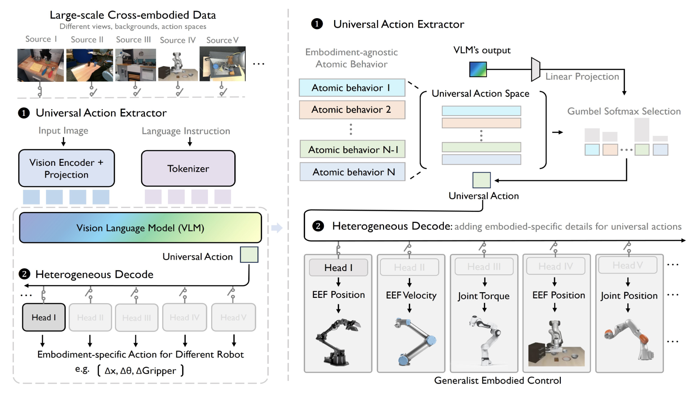
评估了未见机体 AIRBOT 的快速适应。只微调动作 decoder，相比 OpenVLA 和 Octo，微调参数量占比最小、效果最优。不同机型 decoder 对于同一通用 action 的动作有相似性，使用同一段通用动作 chunk，在不同机型上重放了一段相同动作。

统一动作空间的非常简单直接的想法，但没有被后续工作所广泛采纳。
- 训练数据的动作格式和机型过于异构，不适合直接端到端学习
- OpenVLA 架构也被后来 pi 或 GR00T 所取代，由 VLM 直出动作会破坏先验
- 动作 tokenization 尚未充分探索，目前多数策略倾向于连续 diffusion

### XL-VLA(2603.10158)

*灵巧手 tokenization，通过物理意义监督*

Ability Hand, Paxini DexH13, X-Hand1 等灵巧手关节数量、手指形态有所不同，本文训练一个 VAE ，构建不同灵巧手之间的统一动作空间。

除了 MSE 重建损失和 KL loss，还施加**跨本体重定向损失**：

$$L_2 =\frac{1}{|H|(|H|-1)|P|}\sum_{s\neq t}\sum_{(i,j)\in{P}}w_{ij}^{(s)}\left[\lambda_{\mathrm{dis}}\left(\left\|\delta_{ij}^{(s)}\right\|_2-\left\|\hat{\delta}_{ij}^{(t)}\right\|_2\right)^2+\lambda_{\mathrm{dir}}\left(1-c_{ij}^{(s,t)}\right)\right]$$

-  $s$ 和 $t$ 是两种手，从 s 手动作编码，解码到 t 手
-  $P$ 是指尖对集合：拇指–食指、拇指–中指、拇指–无名指、拇指–小指。下面的方向和距离在该集合上计算
- 距离对齐： $\delta_{ij}^{(s)}$ 是重建前 s 手指尖距离；$\hat\delta_{ij}^{(t)}$ 是 VAE 解码到 t 手后指尖距离
- 方向对齐： $c_{ij}^{(s,t)}$ 是两条指尖差向量的余弦相似度，即方向一致性
-  $w_{ij}^{(s)}=\exp(-\lambda_{\mathrm{exp}_{\mathrm{dis}}}\|\delta_{ij}^{(s)}\|_2)$ 是按捏距加权的系数：拇指和手指越接近（对任务影响越大），权重越大
将动作直接联系到物理意义，**无须构造跨本体动作对**。

采用 pi0 的架构训练，在无须额外训练的情况下，泛化到未见的手-任务组合，且优于有监督（即在跨本体动作对上自编码）的方法 LAD(2506.14608)，说明针对物理意义的对齐更加有效。

### X-Tokenizer(2606.14752)

*对 token 施加语义监督*

ground truth 动作，或单纯从动作自监督中学习的隐动作（如 FAST），和上层的任务或视觉完全无关。本文认为，动作 token 不应该只表示本体控制信息，还应带有语义信息。
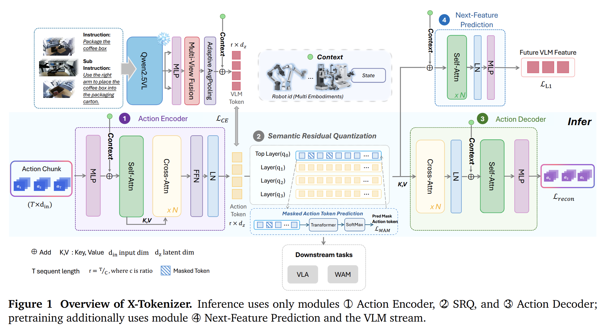

使用 26 维向量表示左右 EEF 位置 + 6D 旋转 + 夹爪 + 基座移动速度 + 头部动作。对一段动作块，经过以下过程：$$a_{t:t+T-1}\;\xrightarrow{\;E_\theta\;}\;h_{1:M}\;\xrightarrow{\;Q_\psi\;}\;\tau_{1:M}\;\xrightarrow{\;D_\phi\;}\;\hat a_{t:t+T-1}$$
- $E_\theta$：用一个 Transformer 编码为 $M$ 个连续 latent（图中 Action Encoder）
- $Q_\psi$：把每个 latent 转成 4 层离散 code（图中**Semantic Residual Quantization**，SRQ）
- $D_\phi$：从量化 latent 重建连续动作（图中 Action Encoder）

包括 4 种损失：
- $\mathcal{L}_{recon}$: RVQ-VAE 基础的重建损失
- $\mathcal{L}_{align}$: VLM(Qwen2.5-VL)接受当前观测、指令，$h_{1:M}$ 与 VLM token 对齐
- $\mathcal{L}_{MAM}$: 对 $\tau_{1:M}$ 施加 BERT 风格重建损失，其中 mask 概率 0.15，且仅会对 4 层 code 中的**第一层**掩码，确保第一层能够学到最主要信息
- $\mathcal{L}_{pred}$: 额外训练一个 Transformer，输入 $\tau_{1:M}$，输出未来的 VLM 特征

在 RoboTwin2 5个单臂任务上进行比较：5 个机型数据共训练一个模型，效果优于每个机型各训练一个模型的表现，在 Hard 任务上差距更明显。

## 隐动作——无监督（视觉监督）

没有动作标签，视觉信息（+语言信息） -> 隐动作 -> 特定机型动作
### LAPA(2410.11758)

*较早的动作无监督学习*

训练一个 VQ-VAE，给定当前帧 $x_t$ 和未来帧 $x_{t+H}$ ​，encoder 输出量化的隐动作 $z_{t}$；给定当前帧 $x_t$ 和隐动作 $z_{t}$，decoder 重建未来帧。该过程只涉及视觉，没有机体和动作要求。

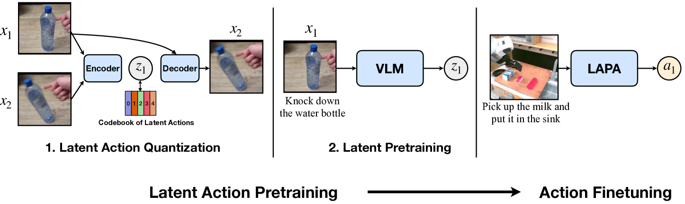
LAPA 训练分为两阶段：
- 重建未来帧 $x_{t+H}$。利用未来帧重建损失，无监督学习隐动作。
- 用于 VLA 训练时，机器人操作数据中的动作标签用隐动作 token 代替，并单独训练 decoder 适配特定动作格式

实验表明，对于 LAPA 预训练，机器人数据效果优于人类数据；数据效率上 LAPA 方法优于 OpenVLA，在更优表现下计算成本仅数十分之一。

### UniVLA(2505.06111)

*区分环境动作和指令动作*

单纯的 LAPA 风格监督从两帧视觉观察中提取动作，这个动作是**任务无关**的，编码了环境噪声（背景、相机运动等），而 VLA 控制需要**以任务为中心**的动作。本文使用 LAPA 损失，用 DINO 特征代替 RGB，采用两阶段训练：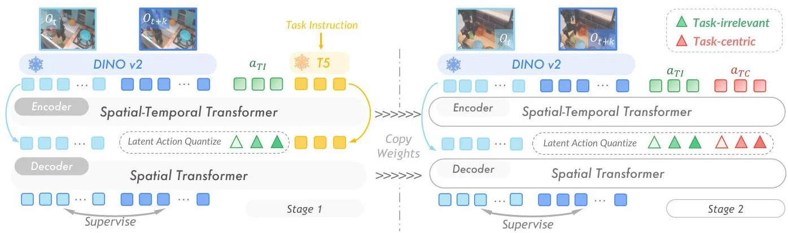
- 任务无关学习。除了 DINO 特征，还以 T5 编码的任务描述为输入，学习离散化隐动作 $a_{TI}$
- “任务动作”学习。不给出任务描述，以第一阶段的隐动作 $a_{TI}$ 作为条件，学习一组新的隐动作 $a_{TC}$

VLA 采用 OpenVLA 架构，将 $a_{TC}$ 扩充到 VLM 词表中，自回归输出隐动作。
- 使用 BridgeV2 预训练，在 LIBERO 和真机中优于 LAPA, OpenVLA, Diffusion Policy
- 使用更多数据源(OpenX, Ego4D)时，真机表现提升
- 没有直接的新机体泛化实验

### LARA(2606.07100)

*同时训练 VLA 和 LAM*
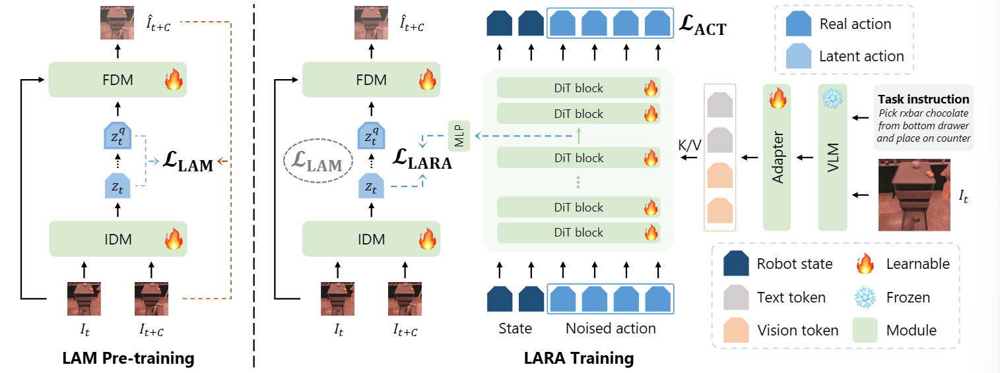
VLA action expert 缺乏物理理解，存在跨具身 gap；LAM 仅依赖像素重建，会编码冗余信息。本文尝试将 action expert 和 IDM 联合起来训练，以同时解决两者问题

除了 LAPA 风格的 VQ-VAE 训练，以及 pi-like VLA 的模仿学习训练，还添加一个 LARA 监督：提取 DiT latent $h_t^θ​$ ，用一个 MLP($f_ψ​$）投影，对齐两个 latent action：$$\mathcal{L}_{LARA}(\theta, \phi, \psi) = -\mathbb{E}_{A_t, \epsilon, \tau} [\text{CosSim}(z^{\phi}_t, f_{\psi}(h^{\theta}_t))]$$
相比纯 BC（DiT-only）的普通 VLA，LARA 预训练 + 后训练，以及仅 LARA 后训练(GR00T-N1.6-LARA)均带来性能提升；相比仅预训练的 LAM，用经过 LARA 对齐的 LAM 隐动作训练 VLA 也带来性能提升。

本文测试了新机体的适应。LARA 在 OXE 数据上训练，使用 G1/GR1 数据（OXE 中没有）进行 LARA 风格微调仅使用 30 段示范。LARA 方法明显优于 LAPA(表中 DiT-only)，但在真机表现上不如更大规模预训练的 GR00T-N1.6（已在预训练中见过机体）。
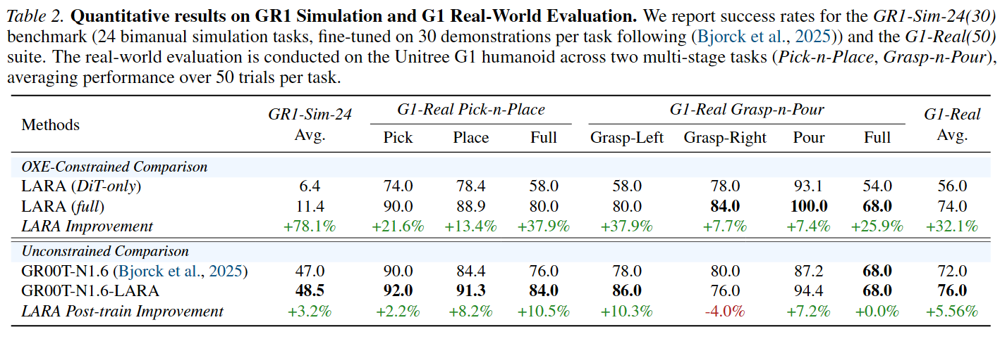
### CLAP(2601.04061)

*区分环境和本体动作，并施加对比学习监督*

用纯视觉无监督学习动作，必然会混杂“整个环境”的动作和“机器人本体”的动作；而在 ground truth 动作标签上训练的策略，仅输出后者。本文首先在 ground truth 动作上自监督学习一个隐动作，以此监督视觉学习的隐动作：
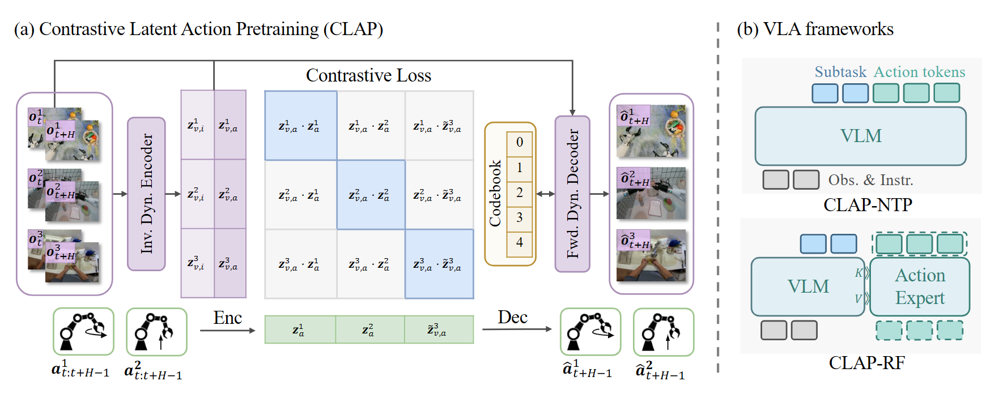
- 第一阶段，训练一个 VQ-VAE(Act-VAE)，将 ground truth 动作离散化为隐动作；
- 第二阶段，LAPA 风格训练视觉 VQ-VAE(VD-VAE)，其中的视觉隐动作显式区分**本体动作** $z_{v, a}$ 和**环境动作** $z_{v,i}$：
	- $z_{v, a}$ 最后离散化到**冻结的 Act-VAE codebook**中，确保只包含本体动作
	- $z_{v,i}$ 采用单独的 codebook 量化，施加 L1 正则化损失
	- loss 包括：LAPA 风格视觉重建损失；VQ 量化损失；对 $z_{v,i}$ 的 L1 正则化损失；**对量化前的 $z_{v,a}$ 和 ground truth $z_{a}$ 对比学习损失**
此外，对于没有 ground truth 的人类视频，采用 EMA 自蒸馏训练 Act-VAE，和上述 VD-VAE 联合训练。

采用类似 pi0.5 的架构，使用真机(AgiBot-beta, DROID)和人类数据(Ego4D)预训练，采集了人类 Ego 和遥操的插花、pick&place 数据微调。

与 UniVLA 进行严格消融，使用同样的 VLM backbone，同样数据训练，在真机 ID/OOD 上测试，结果上依然更优，表明人类数据和对比学习损失均带来收益：
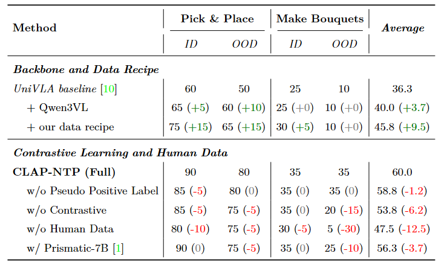

还比较了由姿态估计生成的动作伪标签，以及 Act-VAE 自蒸馏方法生成的伪标签。使用 WiLoR 估计手部姿态并定向到夹爪动作，然后用 CLAP 方法微调。实验表明，添加人类数据训练会减少**语义**错误率，但反而提高了**精细操作**错误率，且 WiLoR 估计的标签略差于 CLAP 无监督学习的标签。

### Motus(2512.13030)

*光流学习隐动作*

采用类似 LAPA 的方法，但没有使用普通 RGB，而是使用视频的**稠密 2D 光流**：$$\text{视频RGB} \xrightarrow{\text{DPFlow}}\text{光流场} \xrightarrow{\text{DC-AE}} \text{离散token} \xrightarrow{\text{轻量encoder}} \text{隐动作}$$ 同样不需要动作标签，在人类 Ego、仿真、真机数据上训练。整个 Motus 模型组合了视频模型(Wan)，VLM(Qwen3-VL)和动作专家。类似 LAPA，首先学习动作 tokenization，然后在隐动作上训练 Motus 主模型，监督包括视频预测和动作重建。

相比纯 RGB 视频，光流捕捉像素点的运动，更适合表达空间动态。Motus 在当时达到 SOTA，但本文及其后续的 MotuBrain 都没有对于跨本体的实验，MotuBrain 甚至放弃了用光流代替 RGB 的设计。
### VLA-JEPA(2602.10098)

*JEPA 方法训练 VLA*

本文借鉴 JEPA 的思想，隐动作训练中不应该提供未来帧，而直接学习预测未来，并由 VLA 提供动作。
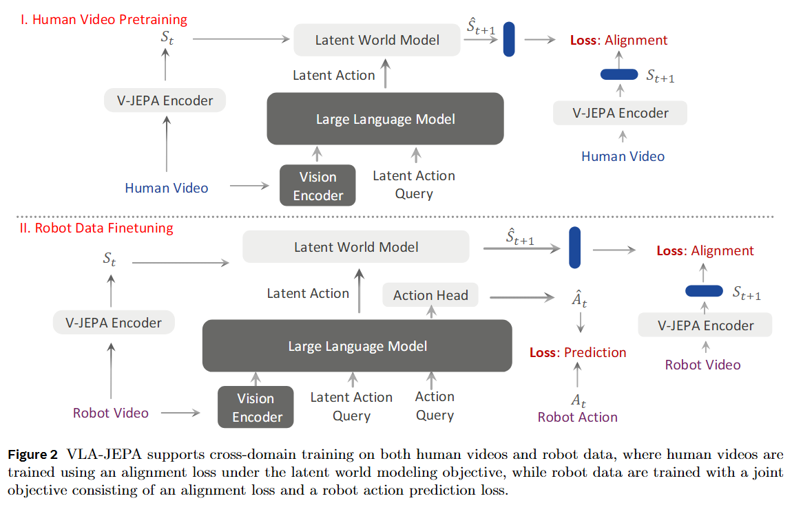
预训练阶段在无标签数据上训练一个 VLM-based VLA 和一个 latent world model。
- 使用 V-JEPA2 编码人类视频，作为 latent world model 输入 $s_t$ 和最终对齐监督 $s_{t+1}$
- VLA 主干为 Qwen3-VL，接受 SigLIP2 编码的视频，输出一个隐动作
- latent world model 接受 latent action 和当前状态，预测下一帧状态 $s_{t+1}$
微调阶段在特定机型、有标签数据上训练，额外训练一个 DiT 动作头，以 VLM 输出作为输入，预测实际动作。

本文消融了人类视频带来的收益，但没有对于跨机体泛化的实验。此外，比较了 LAPA, UniVLA 和 VLA-JEPA 中隐动作对图像的注意力：
- LAPA 的注意力非常分散，包含过多无关细节
- UniVLA 的注意力更加集中，但部分注意力和**本体操作**无关，集中在了背景元素上（笔、桌布上的黑点）
- VLA-JEPA 注意力达到更好集中
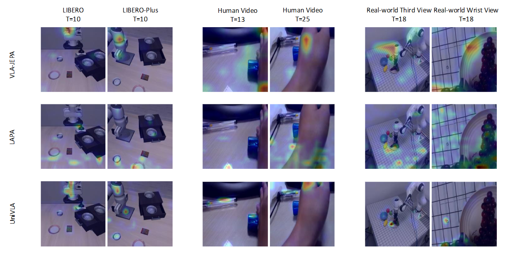

### LaWAM(2606.15768)

*比较新的 LAPA + WAM*

具体架构如图。动作训练方法和 LAPA 区别不大，只是将 RGB 换成 DINO 特征，将 OpenVLA 架构换成 pi 架构。动作头 DiT 除了接受 VLM 输出，还接受 LaWM 预测的未来 DINO 特征。
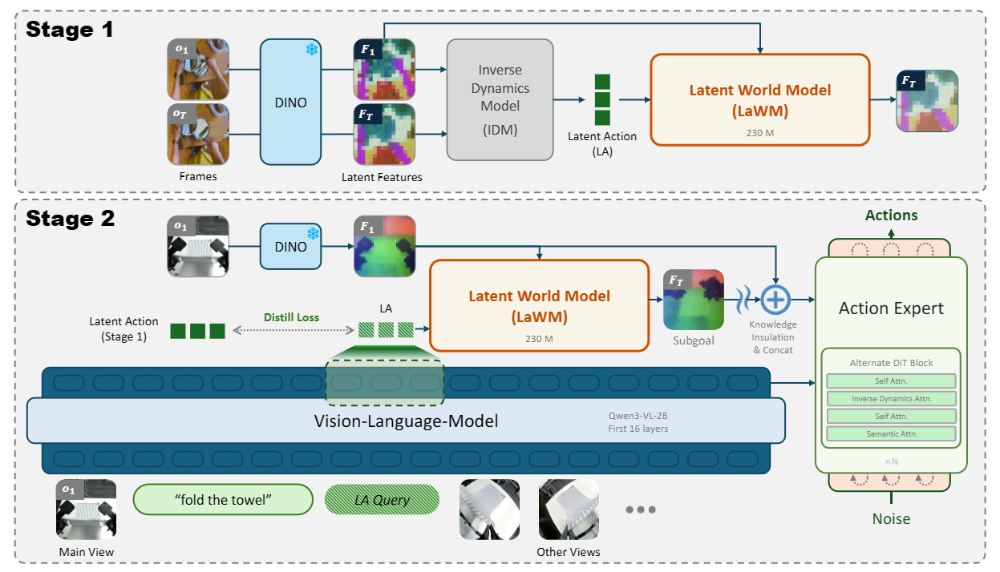

LaWM 在约 4500 小时人类 Ego 和真机视频上训练，LaWAM 在少量数据上预训练。按照本文的报告，在 RoboTwin2 上使用与 LingBot-VA 和 Motus 相同协议，取得更好表现，且推理延迟更低。本文更多强调基于 WAM，没有做跨机体实验。

## 隐动作是什么动作

上述所有论文都试图让模仿学习的“动作”带有更好的表征，但是具体是什么的表征？

直接的模仿学习中，动作即给定本体条件下，本体的低层动作。但不同的论文中隐动作的含义非常不同：
- XL-VLA: 通用的**本体动作**（仅用本体动作监督）
- X-Tokenizer: 带有**任务语义**（用 VLM 特征监督）的本体动作
- LAPA / Motus: 通用的**环境动作**（仅用视觉监督）
- CLAP: 被区分的本体动作（动作自监督）和环境动作（视觉监督）

而其他论文中则各类监督混杂，不能严格控制隐动作的意义。此外，LAPA 训练范式本身也有“泄露未来”的问题。encoder(IDM)已经输入了未来帧，所编码的“隐动作”可能只编码未来帧信息，而忽略当前帧信息或是两帧间的变化。

## 隐动作合理吗

上述论文包含的判断：
1. ground truth 动作的信息过于低维（只和本体控制有关），不能有效监督任务语义/物理知识；
2. 对于不同机体，特别是不同灵巧手，ground truth 动作没有跨机体的意义；
3. 大规模数据中的动作包含很多噪声，影响了学习。动作应该是离散的、压缩的；
4. 从 RGB/视觉特征/视觉-语言特征/物理意义 中学习的隐动作，比原来的 ground truth 更好地表征了“动作”；

但几乎所有开源、规模化训练的 VLA 模型（X-VLA, Pi, GR00T, Qwen-Robot）依然采用类似 Pi 架构，使用 ground truth 动作进行模仿学习；即使使用人类视频，也首先用姿态估计给出伪标签，而不是无监督学习动作。WAM 架构中有部分（Motus, LingBot-VA2）使用隐动作训练，多数训练也仅采取直接的模仿学习。

最后 2 条判断是可被质疑的：
1. 动作离散化
	动作天然是连续的，离散化损失了精细操作能力。此外，离散化并不必然更好学习。
2. 动作可压缩
	可压缩的前提是拥有固定、确定的语义，即能够区分语义和噪声。然而，同一段 ground truth，在不同机体、不同坐标系下均能执行，但效果不同，没有固定语义。只有给出充足的本体条件，动作的语义才是固定的，才能够学习。
	这个问题可通过输入足够的本体条件解决，但许多论文忽视了这一点。
3. 隐动作中的“动作”含义混杂
	直接的模仿学习中，动作有**清晰、单一的物理含义**。但隐动作中可能包含本体动作（“夹爪向镜头正前方移动 10cm”）、任务动作（“杯子被夹起，并离开桌面 10cm”）、环境动态（和控制无关的背景运动）、本体条件等。
	无论预测的动作是什么类型，最后一定要用于控制本体。
	Pi 架构的 VLA 将 VLM 明确用作编码**高层 context**，DiT 动作头明确用于产生**低层动作**。如果动作中重新引入复杂语义，就又需要额外的模块负责原先的输出工作。

对于第 1 条判断，隐动作相比直接的模仿学习，确实能提供额外监督，但 WAM 训练目标提供了一个简洁的“物理知识”监督方法，LAPA 等包含前向动力学预测的隐动作方法可看作 WAM 的变体；VLM 本身已经有强大的 VL 先验，可以通过模仿学习 + VL 辅助训练保留“任务语义”的监督。

第 2 条判断依然是未被解决的问题，但目前有关 隐动作 / 动作 tokenize 的论文并没有充分的探索和消融实验。对这个问题，让不同本体动作具有相同的物理含义是基本思路，例如前文的 XL-VLA 或 OC-VLA(2508.13103, 将 EEF 坐标统一到以相机为原点)。在此，隐动作依然有探索空间。

在真正解决上述问题之前，隐动作依然只是故事。而解决上述问题不仅需要 insight，更需要规模化和高质量的数据。