## 世界模型相关

### Wan-VACE(2503.07598)

*一体化视频编辑*

Wan-VACE 希望在一个模型中解决文本到视频 (T2V)、参考到视频 (R2V)、视频到视频 (V2V)、蒙版视频到视频 (MV2V)的问题。


**输入表示**

VACE 的输入单元使用以下格式表示任何视频生成任务：$V = [T; F; M]$，其中 $T$ 是文本提示，$F = \{u_1, u_2, ..., u_n\}$ 表示上下文视频帧，$M = \{m_1, m_2, ..., m_n\}$ 表示二值掩码

这种统一表示通过特定配置实现不同的任务：
- T2V：仅提供文本 $T$，其中 $F$ 包含零帧，$M$ 包含全 1 掩码
- R2V：在 $F$ 中插入**参考帧**，对应 0 掩码，随后是生成区域
- V2V：在 $F$ 中输入**视频帧**，在 $M$ 中包含全 1 掩码用于完整视频编辑
- MV2V：同时提供输入帧和特定的时空掩码用于局部修改

**Context Tokenization**

输入的帧明确分离为**reactive frame** $F_c$ 和**inactive frame** $F_k$，明确拆分： $F_c = F \times M, \quad F_k = F \times (1 - M)$。

为保证时空对齐，$F_c$、$F_k$ 和 $M$ 需要被映射到同一潜变量空间：
- Fc​、$F_k$ 通过**视频 VAE** 编码到与 $X$ 相同的潜空间，保持时空一致性；
- 参考帧由 VAE 编码后，沿时间维度拼接回去，解码时对应部分会被移除；
- $M$ 直接进行 reshape 和插值。

将 $F_c$、$F_k$、$M$ 在**通道维度**拼接，再 tokenize 成 context tokens。编码 $F_c$ 和 $F_k$ 的权重直接从原始视频嵌入器**复制**而来；编码 $M$ 的权重初始化为**零**。

从原始视频 DiT 中复制部分 Transformer 块处理 context，作为 context block。每一层 context block 的输出重新注入主分支对应位置。训练时，可以全量微调，也可以仅微调 context block。

**数据**

构建数据时，使用 RAM 和 Grounding DINO 进行目标检测，SAM2 进行视频分割；提取深度、姿态、光流等为各种编辑任务生成掩码，并创建参考对。

在实际表现上，VACE 展现了参考、替换、animate、移动特定物体的能力。目前 Wan-VACE 依然是唯一开源的 video edit 模型。

### GenCeption(2607.09024)

*Multi Task, Unified Model & Loss*

CV 长期寻求效仿 NLP，通过同一个范式（NTP）的 scaling 来达成通用智能，无需针对某特定任务修改架构和重新训练。但同时 CV 又常常追求“表征”，偏好“骨干网络+头部”的方法，单独训练共享骨干作为一个 encoder，这其实与 GPT 的 NTP 是背道而驰的。

本文尝试了使用 Wan2.1，用一次 forward （而不是多步去噪）完成深度估计、表面法线预测、关键点跟踪等视觉任务。固定时间步为 $t=0$，VAE 的输入为无噪声的 RGB 视频，一次输出 flow matching。

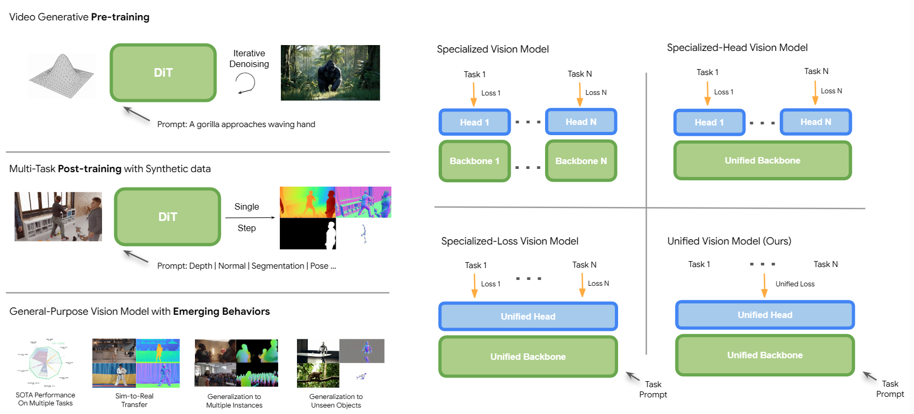

**稠密标注**任务直接在 RGB 空间中表示真值。深度、分割等单一维度输出 1 复制到 RGB 三通道；法线估计和 densepose 天然适合三通道输出。对于机器人动作、关键点坐标等**稀疏任务**，在每个视频帧中添加 learnable token，经过 DiT 后由轻量 MLP 处理。

不依赖任务专有数据集，使用大规模**天然带真值标注的仿真数据**训练。
- 在专有任务上均达到专有模型水平；
- 优于 V-JEPA，VideoMAE 等表征模型的效果，体现了大规模生成式预训练的增益；
- 虽然在合成数据上训练，但对真实世界视频、分布外类别稳定泛化。

### SC3-Eval(2606.18610)

*视频生成用于机器人策略 rollout*

action-conditioned world model(AC-WM) 理论上可以运行一个机器人控制策略，并判断任务是否成功，然而目前的模型缺少多视角一致性、长期轨迹失真、对于不同策略泛化能力差。SC3-Eval 基于 Cosmos3-Nano，通过使用 3 种监督来保证 self-consistent：

1. 前向-逆向动力学一致
	首先进行前向，生成未来帧；然后用未来帧和当前帧运行逆向，生成动作。同时监督动作和未来帧。
2. 跨视角一致
	隐藏一个视角（只给初始帧），监督模型通过其他视角+动作序列来重建。
3. Test-Time 一致
	在真实 rollout 时对每一块预测测试其不确定性。具体来说，使用前向动力学的预测，运行逆动力学重建动作，计算重建和真值的 MSE。差异过大时说明发生了偏移，提前终止 rollout。

在一个 381 小时的真机数据集上先用 SC3 方法训练，然后用于策略闭环 rollout。AC-WM 给定 episode 中的初始状态，运行 episode 中的动作序列，由人工盲审成功与否。SC3-Eval 实现了 r=0.984 的皮尔逊相关系数，并且对 OOD 任务保持稳定性。

### World Value Models(2606.24742)

*世界模型用于估计动作价值*

理想的价值模型给定当前观测，估计当前动作带来的“**任务进展**”，从而获得更加密集的奖励信号。然而，采集数据中并显式不包含“任务进展”这一概念，如何构建数据、评估价值函数的准确性是价值函数的问题。

本文提出用**视频世界模型**作为 backbone。视频世界模型在时间密集的视频上训练，对于理解时序、预测未来有更强的先验。具体来说：
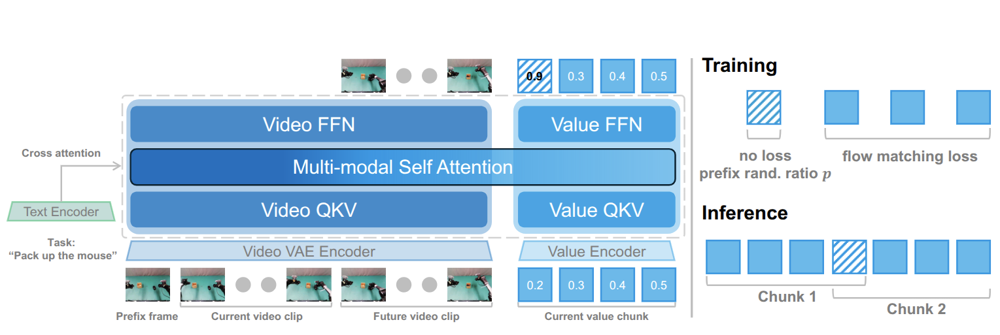

1. 给定 $h$ 帧的观察序列 $o_{t-h+1:t}$ ，语言指令 $l$，一个初始价值 $v_{t-h}$，模型预测一个每帧值的序列 $\hat{v}_{t-h+1:t} \in [0, 1]^h$ 和未来视频 $o_{t+1:t+k+1}$，其中 $v_t = t/T$ 作为真值
2. **数据增强**：示范数据往往价值是递增的。采用两种数据增强：以 $p = 0.5$ 概率将前置 value 替换为随机数，避免模型输出简单数字外推；将视频片段**暂停和倒放**（相应修改价值），制造停顿和重试情景。
消融表明，前缀随机化、未来帧预测都带来正向收益。

使用有意包含犹豫、重试的 800 条轨迹训练，在仿真和真机中评估。本文设计了一套新的评估标准 Suboptimal-Value-Bench，有意评估模型在“犹豫”演示时的预测是否平稳（Hesitation-RMSE），以及是否反映了“重试”时的倒退（Retry-VOC），WVM 均优于之前模型。

WVM 可以用于机器人策略的学习。使用一批脏数据来微调 pi_0.5，当使用 WVM 过滤掉价值不增长的片段，或使用优势加权（AWR）时，成功率显著提升。

### Masked Visual Actions(2607.19343)

*如何向视频模型传达动作？*

要将世界模型用于机器人控制，至少要解决以下问题：
- 模态异构：机器人低维控制信号，和世界模型 2D 像素不在同个模态；
- 稀疏表达泛化差：不输入低维状态，改为输入骨骼/末端轨迹，形式上统一了模态，但无法适应新的机型；
- 双向推理：传统世界模型一般关注**正向**动力学，但机器人控制还需要**逆向**动力学。

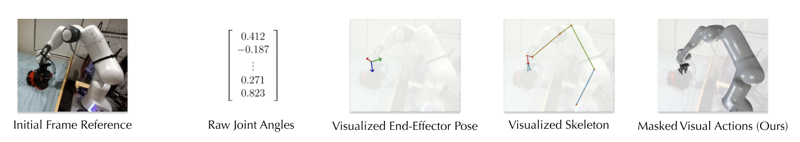


本文通过在像素上施加掩码解决上述问题。掩码对象分为主动实体（机器人本体）和被动实体（被操纵的物体）两种，可以仿真或用 SAM 获得真值。相比骨骼或状态数值，掩码图像更接近稠密像素表示，需要的额外先验（本体形态、状态表示方法、尺度等）更少。

正逆动力学监督均可表示为重建视频，只有输入不同：
- 正向：给出初始帧、**主动实体**掩码视频（即只看到本体）
- 逆向：给出初始帧、**被动实体**掩码视频

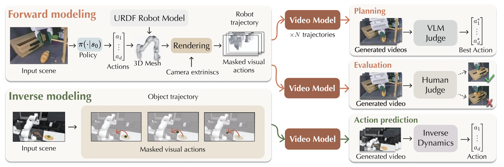

使用 Wan2.2-Fun-Control 14B，在 DROID 和 RoboCasa 上采集共 5000 个演示进行微调。推理时，需要先在仿真中 rollout 本体轨迹，然后才重建完整视频。

在 DROID 数据集上 LPIPS、SSIM 等优于 Control-World。此外，还在 policy evaluation, MPC 以及直接控制真机上进行了评估。


---

## VLA

### Video-Action Generalization Gap(2607.08127)

*WAM 中的 backbone 退化*

在 VLM-based VLA 中，VLM 会随着微调而失去原有能力，从而阻碍了策略的泛化性。实际上，WM-based VLA(WAM) 依然存在这种问题。本文探究了一系列可能影响因素，并提出用类似 CFG 的方法增强策略。

**因素消融**

具体消融包括了微调策略、视频 latent （作为动作头输入）的噪声水平、预测的长度。以 ID 成功率和 ID+OOD 成功率作为指标。
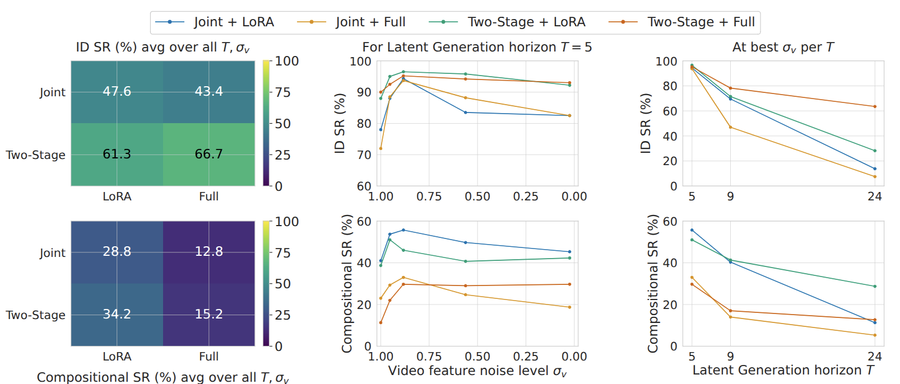
- Joint: 动作头和视频 backbone 联合联合微调， $L_{total} = L_{action} + \lambda L_{video}$ 
- Two-Stage: 先微调视频 backbone，然后冻结 backbone 微调动作头

中等噪声最佳，微调策略 LoRA 优于全量。

**VAG Gap**

本文发现一个现象：视频预测和动作执行并非总是一致：有时视频预测错误，而模型依然正确还有时反之。关键在于，执行过程是分阶段的：
- Planning：比如寻找目标物体、决定放到哪个容器里，策略依赖**未来预测**
- Precise Manipulation：比如机械臂即将抓取物体，或者即将放下物体的瞬间，策略依赖**当前观测**，做反应式的局部反馈控制

提出 Temporal Ratio 指标：**TR = (动作头对未来帧的注意力和) / (动作头对当前帧的注意力总和)**，发现 1) 成功的 episode 总是 TR 更高 2) 在 planning 阶段 TR 更高，在 manipulation 阶段降低。

基于此，提出 TR-Adaptive Guidance：
1. Language Guidance: 计算有无语言指令下的特特征差，以强化指令遵循；
2. Plan Guidance：计算**长短视野**下的特征差，且 CFG scale 有 TR 决定。TR 较高时，处于 plan 阶段，提高 CFG scale。

### Spatial Forcing(2510.12276)

*为 VLA 注入空间感知*

本文首先取一些 VLA 的 latent，训练一个轻量深度头以检查其空间理解能力。发现即使是显式注入 3D 信息的 VLA 模型（SpatialVLA, VidBot, PointVLA），在深度预测任务上表现也较差。
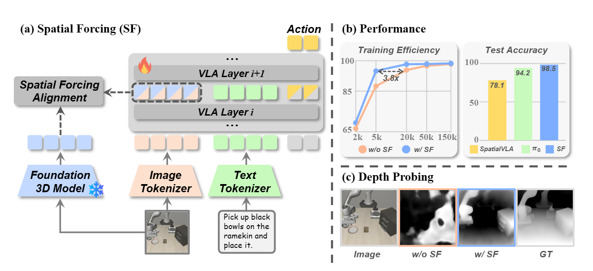
本文设计了一个后训练方法，让 VLM backbone latent 经过两层 MLP，**与 VGGT 特征进行对齐**。相比早期直接结合 3D 模块/ 3D 传感器信息的工作，本文使用 Pi0 和 OpenVLA 微调，在 LIBERO / RoboTwin 上取得更好结果，且数据利用效率更高。

值得注意的是，本文训练的 Sptial Forcing 模型在 RoboDojo 仿真 benchmark 上达到第 4，超过 Pi05、X-VLA 等模型。

### Why Action Chunking(2608.02547)

*action chunking 为何有用*

Action Chunking 往往是机器人策略的默认选择。对于其作用，有 3 种猜想：
- 连贯性：动作是平滑、前后相关的，预测一段动作能够学习相关性；
- 缩短步数：一次执行 k 个动作，相当于缩短了轨迹长度到 1 / k，减少误差累积；
- 表征学习：相当于监督信号更密集。

本文认为，上述三者都不准确。机器人策略是“观测/状态”到“动作”的映射，而人类操作轨迹中，从观测到动作会自然有**延迟**，人类是根据过去做出当前行动的。Action chunking 相当于**同时学习不同延迟下的动作映射**：$a_t|o_t$, $a_t|o_{t-1}$, $a_t|o_{t-2}$, ..., $a_t|o_{t-k}$ ，从而隐式地集成多个“延迟策略”。

进行实验，使用标准 Diffusion Policy，不同动作分块方式：
1. Markovian：实时单步，预测 $a_t|o_t$
2. AC(k)：标准 action chunking，预测 $a_{t-k:t}|o_{t-k}$
3. Delay(d)：延迟单步，预测 $a_t|o_{t-k}$ 
4. AC(n)-RDE：标准 action chunking 训练，但推理时取随机延迟 $i \in [0, n-1]$，执行的动作是 $a_t|o_{t-i}$，**破坏了时间一致性**
5. AC(n)-Ens：多个延迟不同的 Delay(d) 的显式集成，推理时随机取一种 Delay(d) 策略的输出
在 LIBERO, Robomimic 上评估。

结论：
- Delay(d) 优于 Markovian，说明示范轨迹的“非马尔可夫”； 
- Delay(d) 的效果接近 AC(k), 说明时间一致性并非必须；
- 在更难的任务中，AC(n)-RDE 的效果和 AC(k) 各有优劣，说明“隐式集成策略”的假设成立；
- AC(n)-Ens 全面优于 AC(n)-RDE，说明“集成策略”优于单一策略。

### JEPA-WAM(2608.09381)

*用 V-JEPA 特征作为输入和监督*
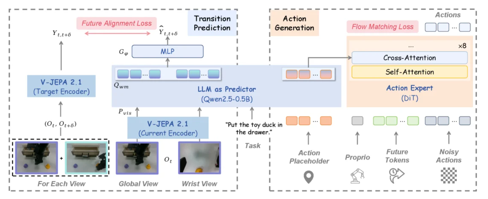

以 V-JEPA encoder token 、文本、动作占位 token 作为输入，V-JEPA predictor token 作为输出监督，微调Qwen2.5B，将经过处理的占位 token 条件化注入 action expert。

比较了对 Qwen2.5 施加不同对齐监督：
- Future only: V-JEPA encoder 编码的未来帧；
- Endpoint difference: V-JEPA encoder 分别编码未来、当前帧，取两者的差值；
- Joint target: 将两帧拼接成视频再编码

LIBERO-Plus 实验上 Joint target 取得最好成功率。

微调后的 Qwen2.5 实际上成为一个“预测器”，其输出的特征可以输入 pi0.5，能够起到增强作用。然而，让 Qwen2.5 接受 V-JEPA 特征作为输入输出的设计显得不太优雅，明显会破坏语言模型原本的知识。


---
## LingBot

### LingBot-Vision(2607.05247)

*自蒸馏训练边界感知 VFM*

DINO 针对整张图像语义训练，忽略细节信息。MAE，iBOT 采用随机掩码+掩码区域监督的方式，将大量监督放在了遮挡平坦、信息冗余的区域。能否训练一个 VFM，既能关注全局语义，又关注像素级几何变化？

本文认为，图像中的“边界”（物体边缘、边界、深度不连续点）是信息冗余最低的地方。提出一种新的自监督方式，监督图像的**边界信息掩码**。采用类似 DINO 的 EMA 自蒸馏方式：
```text
[输入图像] 
   │
   ├──────► 教师网络 (Teacher f_θ̄) ──► 预测边界场 (Categorical Field)
   │                                           │
   │                                  [角点匹配 + 投票解码]
   │                                           │
   │                                  [A-contrario 假阳性过滤]
   │                                           │
   ▼                                           ▼
[学生网络 (Student f_θ)] ◄───强制掩码─── [确定边界 Token 集合 B]
   │
   ├── 掩码 Token 路由：
   │     ├── 边界 Token  ──►  L_iBOT + 几何分类损失 L_bnd
   │     └── 普通 Token  ──►  L_iBOT
   └── 全局 Class Token ──► L_DINO
```
- 边界作为掩码输出，除了学习边界本身位置信息，还可以直接用于 iBOT loss，增强局部语义的学习；
- 先确定“角点”(corner points)，再通过每个像素投票确定边界。教师可以从纯噪声启动，让自蒸馏得以进行
- 边界场离散化，防止连续回归表征坍塌，且能够使用 a-contrario 过滤教师网络中的噪声。

在单目深度估计、语义分割等任务上，以 1B 大小接近 7B 的 DINOv3，超过 V-JEPA 等 baseline；以之作为 backbone 的 LingBot-Depth 达到新的 DOTA。

### LingBot-VA 2(2607.08639)

*具身原生的 WAM*

LingBot-VA 2 的所有组件均为从头训练，使用大规模人类与真机数据，并应用了很多新颖架构设计。

**Visual & Action Tokenizer**

VAE 仅以像素重建为目标，缺少语义层面监督。本文采用新的视频压缩方式，首先进行分割：第一帧打成 16 * 16 patch，之后的整个视频打成 4 * 16 * 16 patch，然后由 专门 encoder 编码：
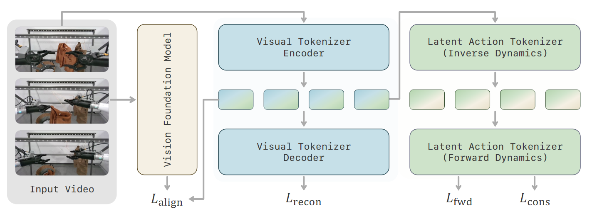

首先训练 visual encoder，除了像素重建监督 $\mathcal{L}_{recon}$，还将 visual latent 与 perception encoder latent 对齐 ($\mathcal{L}_{align}$)。

然后使用训练好的 visual latent 作为视觉状态，训练 IDM (latent action tokenizer)，采用正逆向动力学一致监督：
$$
\mathcal{L}_{\mathrm{fwd}}=\sum_{t=1}^{T'-1}
\left\lVert \hat{z}_{t+1} - z_{t+1} \right\rVert_2^2,\space \space
\mathcal{L}_{\mathrm{cons}}=\sum_{t=1}^{T'-1}
\left\lVert \hat{z}_{t} - z_{t} \right\rVert_2^2
$$

值得注意的是，目前阶段完全使用隐动作，未引入特定机器人关节/执行器动作。当适配特定具身（也可以是人类）时，只要训练一个特定 decoder。


**人类数据用于学习**

人类数据既直接用于预训练，也可用于 In-context learning。

对于预训练，使用真实采集的数千小时 Ego 视频，转换为 6DoF+夹爪 的机械臂动作表示后，与机器人数据混合进行预训练。机器人和人类数据**使用独立的 IDM**进行解码。

对于 In-context learning，先用 caption + 视频生成模型，构造机器人-人类视频 pair，其中两个**视频场景、视角、物体不相同**，仅保持语义相同。将人类示范作为上下文，对机器人视频施加监督。

**从头训练 VA 模型**

Wan 这样的模型主要为了视频美学而训练，与 VA 模型的需求不符。本文使用通用视频数据、机器人、Ego、生成的视频数据从头训练一个 MoE 视频模型。从 T2I 任务开始训练，然后逐渐转到 T2V 任务。在后期才加入动作监督，包括 TI2VA（机器人数据上训练）、ICL（上下文学习）、HCT（用人类动作数据训练）。

视频为分块生成，训练时 chunk size 在 1~4 均匀采样，注意力窗口在 1~64 个 chunk 均匀采样，以支持可变的 context 长度，采用 Diffusion forcing 的方法，历史帧由 0.5 概率加噪。采用**多块预测**（Multi Chunk Predict, MCP），一个轻量 MCP 头以历史帧为条件，预测下一个块之后的 3 块：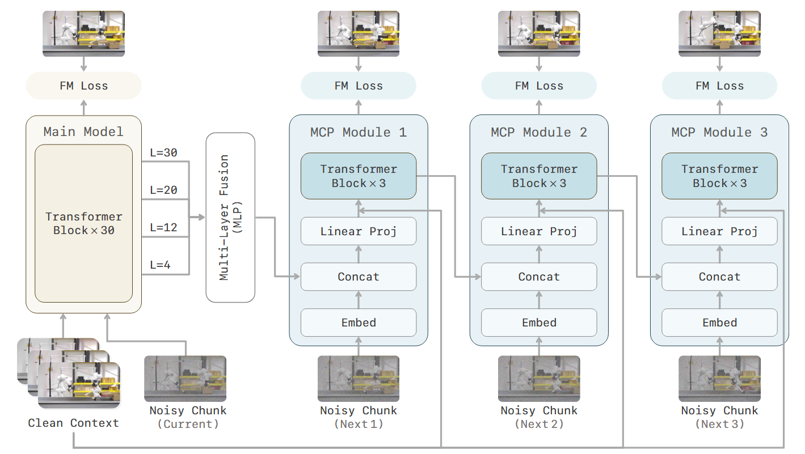


**消融实验**

进行了两个消融实验，说明专用 vision encoder 以及 MCP 的效果： 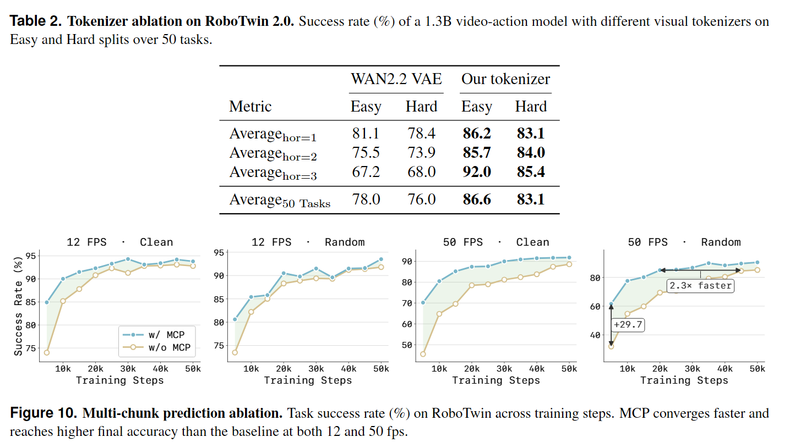

### LingBot-VLA 2.0(2607.06403)

*规模化 MoE VLA*

LingBot-VLA 2.0 总体上是 pi 架构的 VLA，主要的创新包括使用 MoE 架构、对 VLM 主干增加 DINO/Depth 蒸馏监督。

**数据组成和管线**

使用约 50000 小时真机数据、10000 小时 Ego 数据。总共包含 20 种双臂、单臂、人形机器人，EEF 包括夹爪和灵巧手。在筛选数据时，会考虑动作平滑（计算速度、加速度）、状态准确（URDF 投影到相机图像中）、避免模糊遮挡丢帧错位等。对于人类 Ego 视频，额外需要剔除缺乏清晰手部交互、含不可操作物体、出现他人的手的片段。

动作坐标被统一到相机坐标系，使用统一的 55 维**单位向量**表示夹爪、手部关节、腰部、头部和移动。语言指令使用一个有限的原子动作词表，由 VLM 分解子任务。

**深度与语义蒸馏**

在 VLM token 中添加两个 query $[Q_t, Q_{t + T}]$。这两个 token 经过独立投影，分别与当前帧 $o_t$ 与未来帧 $o_{t+T}$ 的 LingBot-Depth 和 DINO-Video 特征对齐。

DINO-Video 从 DINO-v3 初始化，接受视频作为输入，使用时序因果注意力、3D RoPE，采用 3D 的 iBOT 和 DINO 自蒸馏目标。

**动作空间设计**

在真机 4 个任务上进行消融实验，重点探讨了应该使用怎样的动作表示和损失函数。

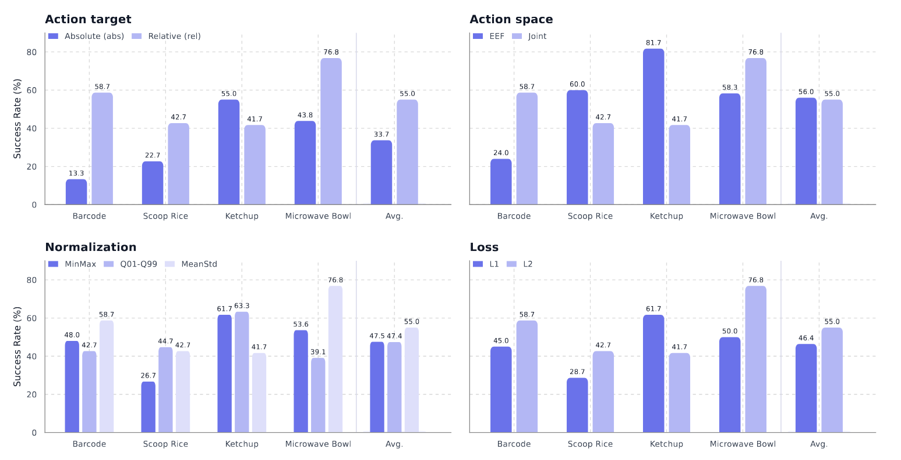
1. 动作目标：相对关节动作 vs 绝对关节动作
	相对动作显著优于绝对动作（55.0 vs 33.7）。相对动作的动作分布显著地更集中，标准差只有绝对动作的 1/3 左右，因此更容易学习。
2. 末端执行器位姿 vs 关节动作
	尽管平均成功率很接近，但不同任务差距显著。本文没有给出很好的解释，统计了不同任务、不同表示格式下的动作分布，但分布差异和成功率无明显联系。
3. 归一化方法（使用相对关节动作）
	相比 MinMax 或 q01-q99 归一化，MeanStd 归一化更优（55.0 vs 47.5/47.4）。本文同样基于分布的解释：MinMax 和 q01-q99 都将动作压缩到一个过窄范围，而 MeanStd 范围最大，反映相对动作的长尾分布。
4. L1 vs L2 损失函数
	L2 损失表现更优（55.0 vs 46.4）。


---
## 其他

### Perception Encoder(2504.13181)

*简单对比学习 scaling 的 VFM*

本文发现，简单的 CLIP 监督方式，已经足以训练一个强大表征模型。之前工作往往用 CLIP 的最后一层输出用于下游任务，导致丢失了空间细节。然而，CLIP 实际上已经让模型学到丰富知识，只是最后被要求与文本语义对齐，导致特征被隐藏在中间层。

本文采用渐进分辨率、数据增强、2D RoPE 训练了一个 2B 大小的 CLIP（$PE_{core}$）。为了利用隐藏层中的特征，采取两种方法，分别训练：
- 语言对齐 $PE_{lang}$（用于 MLLM），取 $PE_{core}$ 第 47 层 latent，通过 2 层 MLP 连接到大语言模型，NTP 微调；
- 空间对齐 $PE_{spatial}$（用于检测、分割等）。同时用原来的 $PE_{core}$ 第 41 层 latent，和 SAM2.1 的 mask logits 进行监督，避免直接学习全局 token 导致丢失空间细节。

在零样本的图像分类、检索超过 SigLIP2；在深度估计、零样本跟踪、目标检测上超越 DINOv2；在 MLLM 的 OCR、VQA、Grounding 上超过专门训练的 visual encoder。


--- 

## 博客及其他文章

### How to Build a Bad Research Center

[原文](https://www2.eecs.berkeley.edu/Pubs/TechRpts/2013/Archive/EECS-2013-123.pdf)

来自图灵奖得主，RISC 发明者，UCB 教授 David A. Patterson，有关"research center"的建设原则：

1. 保持多学科交叉，但是限制组织规模。跨学科但不要跨机构。
2. 限制组织的持续时间（如 5 年，恰好为研究生在校时间），以换取更多尝试的机会。
3. 建立一个原型，能够兼容组织的各个部分。而不是在各自领域内构建玩具演示。
4. 保持开放，无论是组织内还是组织外。在组织内减少围墙，在组织外积极报告和收集反馈。
5. 寻找领袖，能够建立共同愿景。
6. 重视真实影响力，不只是论文发表。


### Make It Work, Then Prove It Works: A Framework for Research

[原文](https://www.vincentsitzmann.com/blog/on_research/)

来自 MIT 教授 Vincent Sitzmann，描述了科研工作的理想流程。

**模式一：乐观主义**

找到一个问题并构想了一个概念方案。此时，应该保持乐观，确信想法是成功的，快速、限时地开始实现，从比较混乱的状态（而不是准备充分的状态）开始不断迭代。

在这个过程中，完成原型设计，并让它运转起来最最重要，而阅读文献、判断有效性会将节奏拖慢。

**模式二：现实主义**

当概念被初步验证后，工作转向证明其有效性。“乐观主义”模式的精髓在于推迟判断，先创造再甄别，先集思广益再批评。但是现在需要怀疑论，让工作更加 solid。

不要执着于原有的想法。消融实验、建立 baseline、文献分析，检查哪些想法最为有效。经历充分质疑之后，可以扩大方法的规模，使用更复杂数据。

### Video Tokenization

[原文](https://x.com/Majumdar_Ani/article/2067619531124506742)

作者为普林斯顿副教授，主要研究方向为机器人学。本文是"Understanding video models"中的第一篇，有关视频模型的 latent space。

**Tokenizer 定义**

tokenizer 这个词可能带来一些误解。视频领域 tokenizer 和 encoder 同义，而非 LLM 中统计词频、将文本转成令牌序列的程序。

Video tokenizer 的首要目标是“压缩”，让视频模型主要参数在一个更紧凑的 latent space 中推理。语言 tokenize 只需统计词频，并按词频分配令牌即可，每个令牌对应的词向量在 NTP 预训练中学习。而视频 tokenize 的主流方法是专门训练 autoencoder，然后再用于预训练。

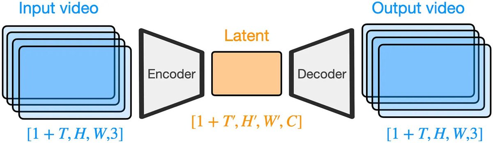
（以 Wan-VAE 为例，时间压缩率是 4，空间压缩率是 8 * 8）

**架构和训练**

主流架构可以分成离散和连续两种。Wan-VAE 是标准连续 VAE。可能反直觉的是，离散化训练更加稳定，且可能增强重建和生成质量。

目前先进的 tokenizer 都已使用 causal mask，即所有 token 只关注到它“之前”的 token。对于 T2V，因果不一定必要（可能还无益），但对于 I2V / V2V 等同模态任务，不同的帧天然具有因果性（输入为因，输出为果），此时 causal mask 反而是更加自然的处理。

以 Wan-VAE 训练为例，首先在图像上训练一个 2D VAE，然后将卷积直接膨胀成 3 维，在视频上采用渐进分辨率训练。训练损失包括重建 L1 loss、KL loss、LPIPS loss（与预训练的 encoder latent 对齐）、GAN loss。

**新兴方法和未来**

视频 tokenize 还未完全收敛，一些研究方向包括：自适应分词（每个 token 压缩率不同）、长视频分词（使用粒度不同的多个 encoder）、多视角分词（确保多视角一致性）等。

此外，一些工作挑战目前 "tokenizer -> latent DiT" 的范式，希望舍弃预训练的 encoder，直接端到端预训练视频生成。

### Video Models: Architecture & Training

[原文](https://x.com/Majumdar_Ani/status/2070155053965480432) "Understanding Video Models" 的第二篇。

**基本架构**

几乎所有视频模型都：
- 使用 DiT 作为主干，在 VAE 压缩后的空间，用 Flow matching 监督
- 去噪时间步通过 AdaLN 来注入：时间步经过一个 MLP，生成与模型宽度匹配的输出，代表 Layer Norm 的参数
- 文本条件通过 T5 或 VLM 编码成 token，一般通过交叉注意力使视频帧注意到

**扩展架构：引入更丰富条件**

后续的视频模型中，条件不只是文本，还可以是参考图、视频、姿态、深度等。ControlNet 是较早的方法，从一个 T2V 模型初始化，通过 **1x1 卷积**将姿态、深度等输入连接到 backbone。卷积零初始化，确保开始时的输出与原模型相同。

后续的 Wan-VACE 支持更复杂输入，包括文本、视频（图像）、掩码输入，显式区分“参考帧”（保持不变）和“反映帧”（应修改），VAE 编码后作为 context token。

对于机器人策略，“动作”是最重要的条件。目前有多种方案，包括直接 cross-attn(Ctrl-World)，AdaLN(DreamDojo)，将动作表示为图像(Genie-Envisioner)等。

**未来**

更新的工作考虑支持“完全多模态”，如 Cosmos3 支持全模态输入输出，用自回归和扩散双塔来分别处理语言和其他模态；Bagel, Transfusion 也同时在语言和视觉生成训练。

### Video Models: Evaluation

[原文](https://x.com/Majumdar_Ani/status/2089719920133038436) "Understanding Video Models" 的第 5 篇。

评估视频模型的生成质量方法，可以从是否有 ground truth、是否供人类观看来区分。

**供人类观看、有 ground truth：视觉准确度**

MSE 指标计算逐帧、逐个像素点之间的均方误差，PSNR 指标则是 MSE 的单调函数。MSE 越小或 PSNR 越大，图像在统计上越接近原图。然而，该指标不能很好反映人类感受的差异。SSIM 和 LPIPS 是两个基于**感知**的质量指标，与人类判断更相关：
- SSIM 是逐个图像块的亮度差、对比度差、协方差的乘积
- LPIPS 计算两图的 AlexNet 特征差异。在与人类对齐的基础上，相比更好的网络（ResNet, ViT 等），AlexNet 对于图像失真更敏感。

**供人类观看、无 ground truth：分布指标**

没有一一对应的视频对（如语音转文本）时，应该比较生成视频与真实视频的分布。
- FVD 利用 3D ConvNet 分别计算两组视频的特征，然后将两者的分布近似为高斯分布，计算 2-Wasserstein 距离。
- VBench 是一套广泛使用的指标，用一系列评估方法（逐帧 CLIP 特征、目标检测）来衡量运动流畅度、主体一致性等更细化的差异。
不过，上述评估只是对人类评估的自动化替代，并不比人类更准确。

**不供人类观看**

视频模型用于下游应用，如物理仿真器、WAM backbone 等时，人为评估不再是最佳标准。一段生成可能美学质量较高，但是不符合物理。

用于模拟器，可以在现实世界中获取真实视频；用于机器人控制，可以端到端测试成功率等任务进度评价。

### AI Isn't Outthinking Mathematicians

[原文](https://davidepiffer.com/p/ai-isnt-outthinking-mathematicians) 作者 Piffer Pilfer 研究范围包括遗传、智力、创造力等。本文认为，AI 不一定比数学家“更会思考”（outthinking），而是记忆力更好。

LLM 拥有相比人类更大的工作记忆**容量**，并且工作记忆是**可编辑**的，这个差异在数学上会被放大。
- 数学表达是固定、无歧义的，不因信息变多而模糊或失效
- 解答和推理过程（无论人还是 LLM）依赖大量文本
LLM 可以通过显式地修改维护工作记忆，保持没有矛盾且细节丰富的状态；人的记忆不仅可能矛盾（现在的结论推翻之前的结论），还必须丢掉很多细节。

然而，一个非形式化的推理与数学推理不同。
- “公平”“成功”等概念并不精确，而是取决于语境
- 没有确定性的推理，没有明确对错
- 更多或更少的文本都会影响语境
在此情况下，更长的上下文不一定有用。

总结来说，LLM 在约束条件复杂、精确符号记录、反复召回先前内容的任务里优势显著，但在依赖一次简短"Leap"的问题优势较小。


### 其他

- [新理解矩阵](https://kexue.fm/archives/1765) 苏剑林博客
- [A Safe Path to Open Weights](https://thinkingmachines.ai/blog/a-safe-path-to-open-weights/) Thinking Machines 对于开源模型的观点
- [Interviewing Engineers in the AI Era](https://www.coinbase.com/en-sg/blog/interviewing-engineers-in-the-ai-era-lessons-from-a-year-of-rebuilding) 构建 AI-Native 的面试筛选
- [Power 2026](https://power2026.ai/) 发电厂和电力市场的基本知识
- [How to Keep Thinking](https://www.seangoedecke.com/how-to-keep-thinking/) 为何和如何保持思考
- [Git at Any Scale](https://cursor.com/blog/git-at-any-scale) 介绍了大规模 git 代码托管平台背后的基础设施